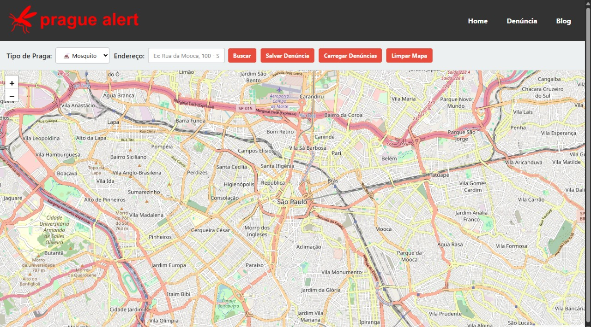

# Sistema de Alerta de Pragas (Prague Alert)

Esse projeto tem como objetivo coletar denúncias de pragas urbanas realizadas pelos usuários em sua localização.
---

## Conteúdo do Site
- Dashboard informativo sobre as denúncias.
- Sistema de denúncia por um mapa.
- Blog informativo sobre como combate-las

---

# 🌐 Tecnologias Web Utilizadas

- **HTML** - Estruturação da página web  
  

- **CSS** - Estilização da interface  
  

- **Firebase** - Autenticação de usuários e banco de dados em tempo real  
  

- **JavaScript** - Lógica do dashboard e integração com mapas  
  

## 🧑‍💻 Equipe
- Eduardo Custódio Vieira  
- Caio Tavares
- Davi pérez
- Eduardo Araújo
- Gabriel Santos
- Enzo Silva

---

## 📌 Status do projeto
🚧 Em desenvolvimento – Funcionalidades em andamento:
- Aperfeiçoamento na autenticação (Esqueci a senha.)

---

## 📫 Contato

Fique à vontade para contribuir ou tirar dúvidas!

- GitHub: [@ductvi](https://github.com/ductvi)
- Email: eduardocustodiovieira01@gmail.com
